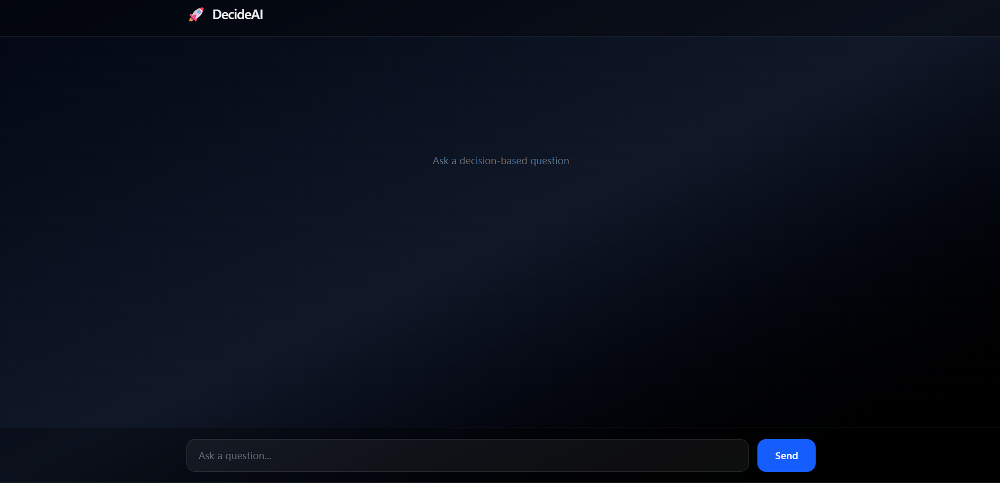
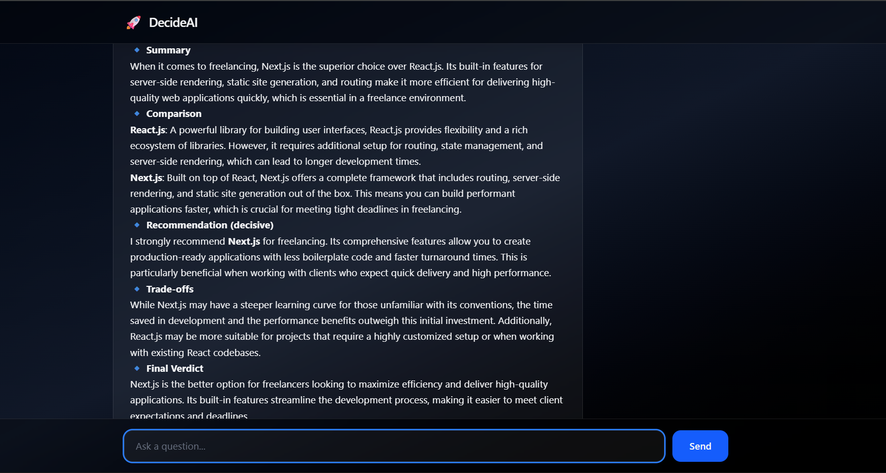

# 🚀 DecideAI – Multi-Agent Decision Intelligence System

An advanced AI system that **doesn't just answer — it makes decisions** using multi-agent reasoning, DAG execution, and real-time streaming.

---

## 🧠 Problem

Most AI apps:
- Generate generic responses
- Lack reasoning structure
- Don’t evaluate or refine outputs

---

## 💡 Solution

DecideAI introduces a **decision-making pipeline**:

- Task decomposition (Planner)
- Multi-agent execution (Research, Comparison, Reasoning)
- DAG-based dependency handling
- Self-correcting loop (confidence-based)
- Semantic memory (context-aware responses)
- Real-time token streaming

---

## ⚙️ Architecture

```
User Query
↓
Task Decomposer
↓
DAG Executor (parallel + dependent tasks)
↓
Tool Router (LLM-based)
↓
Agents (Research / Comparison / Reasoning)
↓
Evaluator (self-correct loop)
↓
Aggregator
↓
Streaming Generator

```
---

## ⚡ Features

- 🧠 Multi-agent architecture
- 🔀 Dynamic tool routing with confidence scoring
- ⚡ Parallel execution + dependency-aware DAG
- 🔁 Self-correcting feedback loop
- 💾 Semantic memory (vector-based)
- ⚡ Real-time streaming UI
- 🎯 Structured decision outputs

---

## 🛠️ Tech Stack

### Backend
- FastAPI
- LangGraph
- LangChain
- OpenAI API
- ChromaDB

### Frontend
- React (Vite)
- TailwindCSS
- React Markdown

---

## 📸 Demo

### UI


### Example Output


---

## 🎥 Live Demo

👉 Coming soon...

---

## 🧪 Example Query

> Compare React and Next.js and recommend the best one for freelancing

### Output includes:
- Summary  
- Comparison  
- Recommendation  
- Trade-offs  
- Final Verdict  
- Confidence  

---

## 🚀 Run Locally

### Backend

```bash
cd backend
pip install -r requirements.txt
uvicorn main:app --reload
```

```
Frontend
cd frontend
npm install
npm run dev

```

```
🔐 Environment Variables

Create .env:

OPENAI_API_KEY=your_api_key

```


## 📈 What Makes This Different?

Unlike basic AI apps:

Makes decisions, not just responses
Uses DAG execution (industry-level design)
Supports multi-agent collaboration
Includes self-evaluation + retry logic


# 👨‍💻 Author

**Ankit Sangode**

**GitHub: https://github.com/AnkitSangode**

**LinkedIn: https://www.linkedin.com/in/ankit-sangode-n/**


**⭐ Star this repo if you found it useful!**

---

